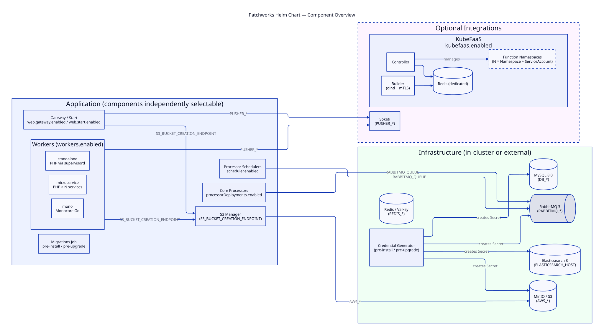
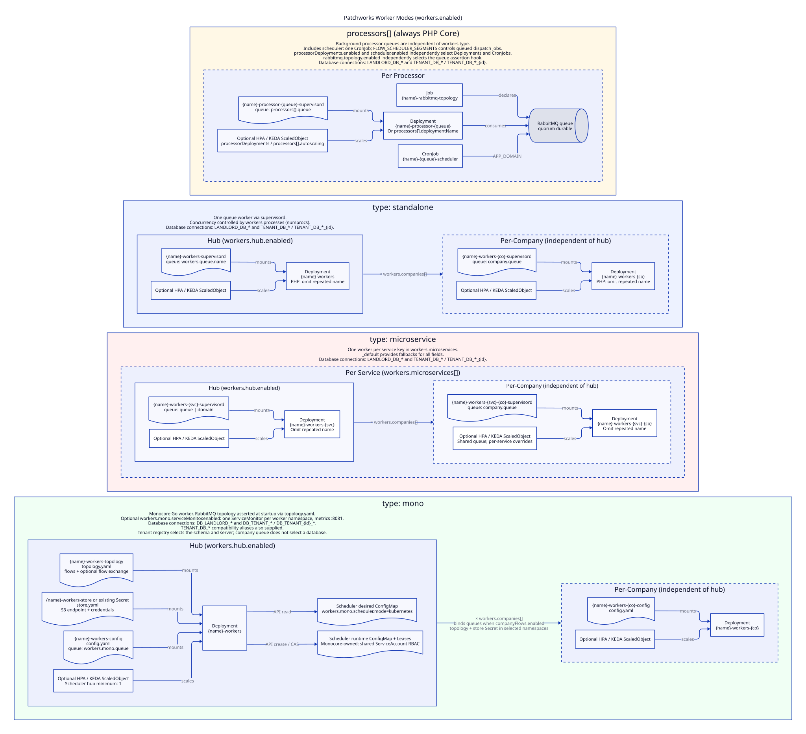

Patchworks Self-Hosted
===

Self-hosted deployment of Patchworks Core via Helm.

---

## Overview



---

## Worker modes



---

## Getting started

Stand up a complete local environment with [kind](https://kind.sigs.k8s.io) (Kubernetes in Docker). Everything runs in-cluster — MySQL, Redis, RabbitMQ, Elasticsearch, MinIO, and the Patchworks application itself.

Total time: ~10 minutes.

### Prerequisites

| Tool | Install |
|------|---------|
| [Docker](https://docs.docker.com/get-docker/) | Desktop or Engine 20+ |
| [kind](https://kind.sigs.k8s.io/docs/user/quick-start/#installation) | `brew install kind` |
| [kubectl](https://kubernetes.io/docs/tasks/tools/) | `brew install kubectl` |
| [Helm](https://helm.sh/docs/intro/install/) | `brew install helm` |

### 1. Create the cluster

```bash
kind create cluster --config docs/kind/cluster.yaml
```

The cluster config maps host ports 80 and 443 to the node (used if you later add an ingress controller) and labels the node `ingress-ready`.

Confirm it's up:

```bash
kubectl cluster-info --context kind-patchworks
kubectl get nodes
```

### 2. Install Helm chart dependencies

```bash
helm dependency update charts/patchworks
```

Downloads the Soketi sub-chart. Only needed once (or after updating `Chart.yaml`).

### 3. Install the chart

```bash
APP_KEY="base64:$(openssl rand -base64 32)"

helm install patchworks ./charts/patchworks \
  --set app.key="$APP_KEY" \
  --set app.url="http://localhost:8080" \
  -f docs/kind/values.yaml \
  --timeout 10m \
  --wait
```

`--wait` blocks until every Deployment and Job is ready. Infrastructure starts first, then the migrations Job runs, then Core Web and Workers start.

### 4. Watch the rollout

```bash
kubectl get pods --watch
```

Startup takes **3–7 minutes** on a typical laptop — Elasticsearch is usually the slowest. When complete:

```
NAME                              READY   STATUS      RESTARTS
patchworks-elasticsearch-xxxx     1/1     Running     0
patchworks-migrations-xxxx        0/1     Completed   0
patchworks-mysql-xxxx             1/1     Running     0
patchworks-rabbitmq-xxxx          1/1     Running     0
patchworks-redis-xxxx             1/1     Running     0
patchworks-s3-xxxx                1/1     Running     0
patchworks-web-xxxx               1/1     Running     0
patchworks-workers-xxxx           1/1     Running     0
```

### 5. Access the application

```bash
kubectl port-forward svc/patchworks-web 8080:80
```

Open [http://localhost:8080](http://localhost:8080).

---

## Useful commands

```bash
# Tail application logs
kubectl logs -l app.kubernetes.io/component=web -f
kubectl logs -l app.kubernetes.io/component=workers -f

# Run an artisan command
kubectl exec -it deploy/patchworks-web -- php artisan <command>

# Open a MySQL shell
kubectl exec -it deploy/patchworks-mysql -- mysql -upatchworks -ppatchworks patchworks

# MinIO console (login: minioadmin / minioadmin)
kubectl port-forward svc/patchworks-s3 9001:9001
# Open http://localhost:9001

# Upgrade after a values change
helm upgrade patchworks ./charts/patchworks \
  --set app.key="$APP_KEY" \
  --set app.url="http://localhost:8080" \
  -f docs/kind/values.yaml \
  --timeout 10m \
  --wait
```

---

## Add an ingress controller (optional)

If you prefer hostnames to `port-forward`, install Contour and enable ingress:

```bash
./docs/kind/setup-contour.sh
```

Add the hostnames to `/etc/hosts`:

```bash
echo "127.0.0.1 patchworks.local core.local start.local fabric.local" | sudo tee -a /etc/hosts
```

Then upgrade the release with ingress enabled:

```bash
helm upgrade patchworks ./charts/patchworks \
  -f docs/kind/values.yaml \
  --set app.key="$APP_KEY" \
  --set ingress.enabled=true \
  --set ingress.className=contour \
  --set ingress.hosts.gateway=core.local \
  --set ingress.hosts.start=start.local \
  --set ingress.hosts.fabric=fabric.local \
  --set ingress.hosts.dashboard=patchworks.local \
  --namespace patchworks \
  --timeout 5m \
  --wait
```

The dashboard is then available at [http://patchworks.local](http://patchworks.local).

---

## Tear down

```bash
kind delete cluster --name patchworks
```

Removes all containers and volumes. Nothing persists to the host.

---

## Troubleshooting

**Pods stuck in `Pending`**

Usually resource pressure. Docker Desktop on macOS defaults to 2 CPUs and 2 GB RAM — increase to at least 4 CPUs and 6 GB in Docker Desktop → Settings → Resources.

```bash
kubectl describe node patchworks-control-plane
kubectl describe pod <stuck-pod>
```

**Elasticsearch stuck in `Init:0/1`**

The init container sets `vm.max_map_count` on the node via a privileged sysctl. If it fails, set it directly:

```bash
docker exec patchworks-control-plane sysctl -w vm.max_map_count=262144
kubectl delete pod -l app.kubernetes.io/component=elasticsearch
```

**Migrations Job failed**

The Job waits for all infrastructure before running. Check which dependency isn't ready:

```bash
kubectl logs job/patchworks-migrations -c wait-for-deps
kubectl logs job/patchworks-migrations
```

A `helm upgrade` triggers a fresh Job run.

---

## Configuration

Full configuration reference — all values, their defaults, and examples — is in the [chart README](charts/patchworks/README.md).

---

## Documentation

| | |
|---|---|
| [Chart configuration reference](charts/patchworks/README.md) | All `values.yaml` keys and example configurations |
| [Chart overview diagram](docs/chart-overview.svg) | Every managed component and how they connect |
| [Worker modes diagram](docs/workers-diagram.svg) | Standalone, microservice, and mono worker types |
